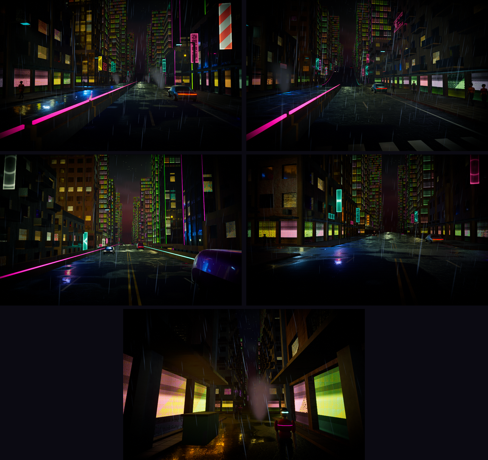

# BenchDeck

Steam Deck 実機で「Cyberpunk 2077 を Deck 向け設定で動かしたとき」と同程度の GPU 負荷（平均 40fps）になる
Android 向け GPU ベンチマーク。ゲームの複製ではなく、負荷の構成要素（ネオン・濡れた路面・霧・群衆・影）を
再現した合成シーンを、Google の物理ベースレンダラ [Filament](https://github.com/google/filament) で描く。

- **APK**（Android 11 / API 30 以上、Vulkan 1.1 以上、arm64-v8a、16KB ページ対応）
- **Linux 版**（同じシーン・同じマテリアル・同じ Filament。Steam Deck での基準取りに使う）
- 固定カメラパス 60 秒（大通り → 高架 → 路地）× 3 周を計測。スコアは Deck = 1000 の相対値



## スコア

```
Score = 1000 × ( 0.7 × 平均fps / 平均fps_Deck + 0.3 × 1%low / 1%low_Deck )
```

- フレーム時間は **GPU 時間と CPU 時間の大きい方**（`Renderer::getFrameInfoHistory()` の `gpuFrameDuration` と
  beginFrame〜endFrame）。表示間隔は使わないので、60Hz / 120Hz 画面の差は入らない
- 1% low = 遅い方から 1% のフレームの平均フレーム時間の逆数
- スコアは **Deck プリセットの時だけ**。他のプリセットは fps のみ
- Deck 基準値は `scenes/scene_v1.json` の `baseline`。**未設定の間はスコアを出さない**（下のキャリブレーション参照）

## 使い方（Android）

1. [Releases](../../releases) から `benchdeck-<版>-arm64.apk` を落とす（`.sha256` で照合できる）
   - 正式な署名鍵ができるまでは `benchdeck-<版>-arm64-debugkey.apk`（Android SDK の debug 鍵で署名した最適化済みリリース版）。
     正式な鍵の版が出たら、一度アンインストールしてから入れ直す
2. ブラウザ／ファイラーに「提供元不明のアプリ」を許可してインストール
3. プリセットを選んで「計測開始」。冷却待ち → 読込 → ウォームアップ 1 周 → 計測 3 周（約 4 分）
   - 冷却待ちは「その端末がこれ以上冷えない所」まで待つ。Android 15 以降でメーカーの熱しきい値がある端末は
     「軽い制限」の手前（しきい値 − 0.05）、無い端末はヘッドルームが下がり止まるまで（60 秒で 0.02 未満の低下）。
     最大 10 分、「今すぐ開始」も可。開始理由と開始時のヘッドルームは結果 JSON の `cooling` に残る
4. 結果画面から JSON / CSV を共有

計測中にホームへ戻る・画面を回す・通知で裏に回る・メモリが逼迫すると、その計測は「中断」として記録される。
周回中にサーマル状態が MODERATE 以上になった周回は無効、SEVERE 以上で即停止（サーマル停止）。

## 使い方（Linux / Steam Deck）

```sh
tar xzf benchdeck-<版>-linux-x86_64.tar.gz && cd benchdeck-<版>-linux-x86_64
./benchdeck                       # Deck プリセット、ウィンドウ 1280×800
./benchdeck --fullscreen          # Deck の画面いっぱい
./benchdeck --preset high --laps 1 --no-warmup
./benchdeck --headless --shots out    # 固定カメラ5点の撮影（画像差分用）
```

結果は `results/benchdeck_<preset>_<時刻>.{json,csv}`。必要なのは SDL2 と Vulkan ドライバだけ（C++ ランタイムは静的リンク）。

## Steam Deck でのキャリブレーション（基準値の確定）

1. 条件を固定：SteamOS デスクトップモード、TDP 15W、フレーム制限なし、画面リフレッシュ最大、充電器接続、室温で 5 分アイドル
2. `./benchdeck --fullscreen` を 3 回。平均 fps が **38〜42** に入るか見る
3. 外れたら `scenes/scene_v1.json` のノブを効きの大きい順に調整：
   `lights.neon_point / neon_spot`（ライト数）→ `presets.deck.fog.grid`（フォグ格子）→ `crowd.count`（群衆）→
   `city.lod_distances_m`（ポリゴン量）。内部解像度 67% とプリセットの構成は Cyberpunk に合わせてあるので動かさない
4. 結果 JSON の `sections` を見て、1 区間だけ極端に重い／軽いならその区間の負荷を均す
5. 確定したら `./benchdeck --fullscreen --write-baseline scenes/scene_v1.json` で baseline を書き込み、`version` を上げる
6. 受け入れ基準：平均 38〜42 fps、1% low 32 fps 以上、同一機 3 回の平均 fps の変動係数 3% 以下

`version` を上げたらスコアの互換性は切れる（リリースノートに自動で書かれる）。

## Drive（仮）— 同じ街を運転する（別アプリ）

ベンチの街と描画をそのまま使い、Bluetooth のゲームパッドで自由に走る。ガチのレースではなく、雨の夜の街を流して楽しむ手触り。
APK は Releases の `citydrive-<版>-arm64….apk`（ベンチとは別アプリとして並んで入る）、Linux 版は tar の中の `./citydrive`。

| 操作 | ゲームパッド | キーボード（Linux） |
| --- | --- | --- |
| ハンドル | 左スティック | A / D、← / → |
| アクセル / ブレーキ・後退 | RT / LT | W / S、↑ / ↓ |
| サイドブレーキ（ドリフト） | A | Space |
| 視点の切り替え / 道路に戻す | Y / B | C / R |
| 見回す / ヘッドライト / 一時停止 | 右スティック / SELECT / START | — / H / Esc（終了） |

設計（車の手触り・当たり判定・カメラ・音）と既知の制限は [docs/DRIVE.md](docs/DRIVE.md)。

## ビルド

Linux ホスト（Ubuntu 24.04 で確認）。Filament の Linux 版が clang + libc++ なので、こちらも合わせる。

```sh
sudo apt install clang libc++-dev libc++abi-dev libsdl2-dev ninja-build cmake
tools/fetch_filament.sh                 # Filament v1.77.1（SHA-256 を照合して third_party/filament/ へ）
python3 tools/assets.py all             # 任意：CC0 素材（無ければ同じ役割のテクスチャを実行時に生成）

CC=clang CXX=clang++ cmake -S . -B build -G Ninja -DCMAKE_BUILD_TYPE=Release
cmake --build build && ctest --test-dir build

cd android && ./gradlew assembleDebug  # ANDROID_HOME に platform 36 / NDK 29.0.14206865 / CMake 3.31.6
```

マテリアル（`materials/*.mat`）はビルド時に Filament 同梱の `matc` でコンパイルされる（Linux 版・APK とも）。
Android のビルドもマテリアルのために Linux の `matc` を使うので、ビルドホストは Linux。

## 構成

```
core/         bench_core（C++20）：シーン定義 / 手続き生成 / カメラパス / 描画(render/) / 計測・スコア
drive/        ドライブ（別アプリ）：車両・当たり判定・追従カメラ・走行音・ゲームループ、Linux 版 citydrive
linux/        SDL2 ホスト（ウィンドウ・ヘッドレス・撮影・キャリブレーション）
android/      Gradle プロジェクト：app（ベンチ）と drive（ドライブ）。Kotlin + Compose の UI、JNI、C++ の描画スレッド
materials/    .mat ソース（外壁・付帯物・路面・看板・人・車・空・雨・蒸気・霧）
scenes/       scene_v1.json（負荷のノブ）と camera_path_v1.bin（30Hz のキー）
tools/        Filament 取得、素材の取得・変換、画像差分、エミュレータ試験、リリースノート
docs/         仕様との対応表（SPEC_NOTES.md）
```

描画・計測は全部 `core/` にあり、Android と Linux は薄いホスト。Android でも Filament の Java API は使わず、
C++ API を NDK から直接呼ぶので、Deck で基準を取ったコードと APK のコードは同一。

## 結果の形式

JSON（`benchdeck-result/1`）：`score`（Deck プリセットかつ baseline がある時だけ）、`summary`（全有効周回）、
`sections`（大通り・高架・路地）、`laps`（周回ごと、無効理由つき）、`device`、`timing_method`、`gpu_coverage`、
`render_stats`（視界内の光源数・三角形数・ドローコールの推定）、`cooling`（Android のみ：冷却待ちの開始理由・開始時ヘッドルーム・目標・待ち秒数）、`frames`（全フレームを列指向で：
周回・時刻・区間・フレーム時間・GPU/CPU 時間・表示間隔・サーマル状態・ヘッドルーム）。

CSV（サマリ）：

```
run,preset,section,avg_fps,low1_fps,p99_ms,gpu_ms_avg,cpu_ms_avg,backend,device,thermal_max
```

`run` は周回番号（無効な周回は `2*` のように `*` 付き）、最後の行 `mean` が有効周回全体。

## テストと CI

| 種類 | 内容 | 合格条件 | どこで |
| --- | --- | --- | --- |
| 単体 | 手続き生成の決定性、スコア、1% low、JSON、カメラパス、周回・サーマル・中断 | 全件成功 | `ctest` / CI |
| 煙テスト | Linux 版をソフトウェア Vulkan で 1 周 | 有効周回 1、GPU 方式で計測 | CI |
| 決定性 | 同じ入力で 2 回撮影 | 画素一致 | CI |
| 16KB ページ | Android 15 の 16KB ページ・エミュレータで起動〜計測完了 | クラッシュなし | `emulator.yml` |
| 描画一致 | Linux 版（エミュレータと同じ SwiftShader で描画）と APK の固定カメラ 5 点 | 1/4 縮小 PSNR 29 dB 以上・色の偏り 5.5 以下（根拠は `docs/SPEC_NOTES.md`） | `emulator.yml` |
| 実機 | ハイエンド / ミドル / Mali / 下限（Vulkan 1.1・RAM 6GB）で 3 回 | 有効 3 回、変動係数 3% 以下 | 手動 |

タグ `v*` を push すると、テスト → APK / Linux 版ビルド → apksigner で署名 → Release 作成まで自動で走る
（署名鍵は Secrets。詳しくは `.github/workflows/release.yml`）。

## ライセンスと出典

コードのライセンスは未定（決まったら `LICENSE` を置く）。素材・ライブラリの出典は [CREDITS.md](CREDITS.md)。
実ゲームのアセット・名称・ロゴは使っていない（街・人・車・看板はすべて手続き生成、看板の模様も文字ではない幾何模様）。
